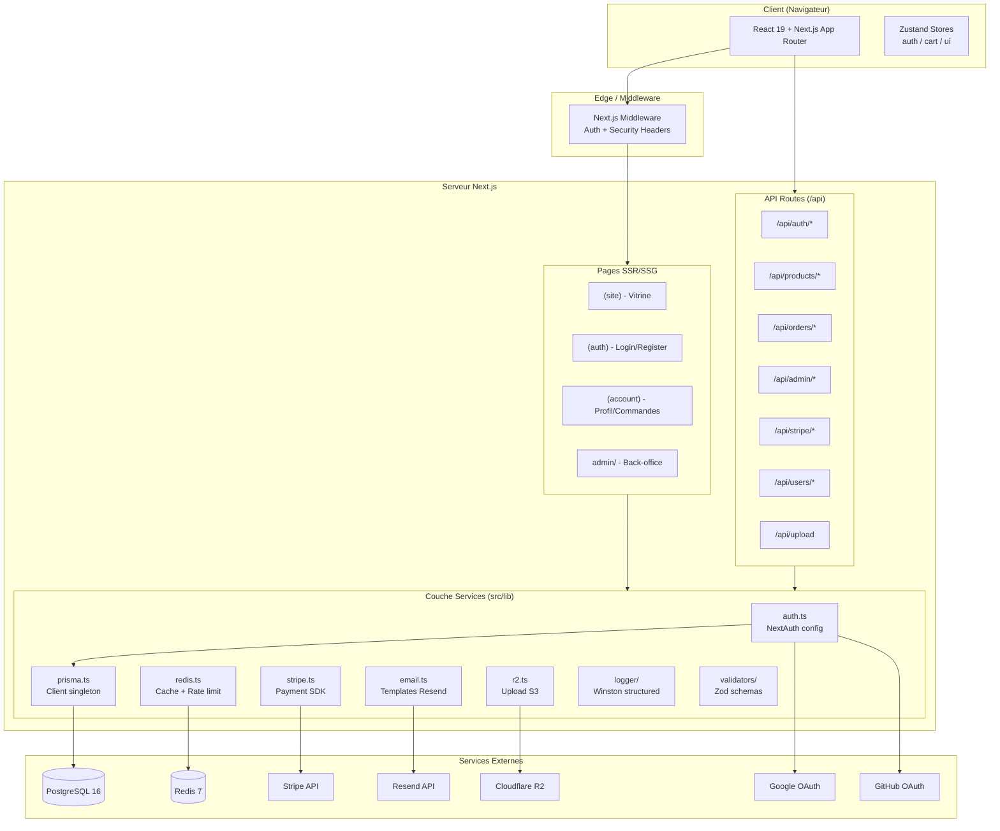
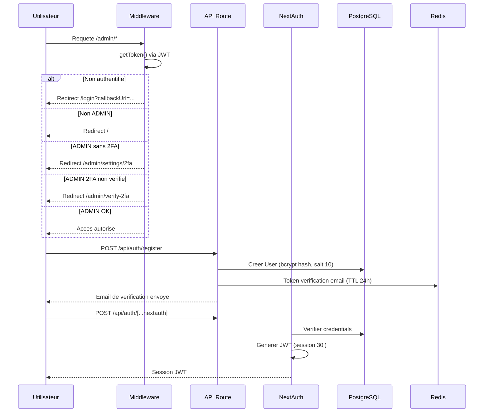
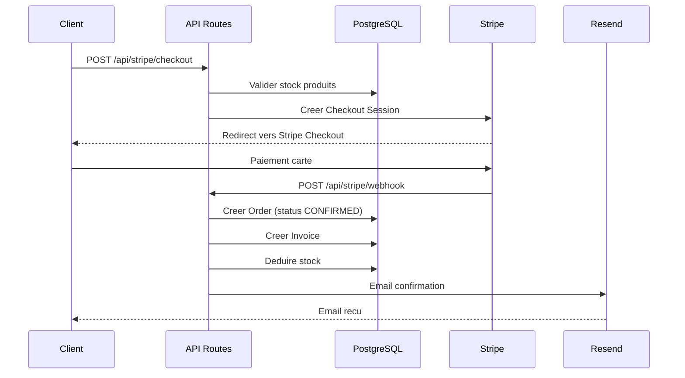

# Architecture technique - Althea Systems

## Vue d'ensemble

Althea Systems est une plateforme e-commerce B2B de materiel medical construite avec Next.js 16 (App Router). L'architecture suit le modele monolithique modulaire avec separation claire des responsabilites.

## Stack technique

| Couche | Technologie | Version | Role |
|--------|------------|---------|------|
| Framework | Next.js | 16.x | SSR, App Router, API Routes |
| Runtime | Node.js | 20.x | Execution serveur |
| Langage | TypeScript | 5.x | Typage statique |
| ORM | Prisma | 6.19.x | Acces donnees, migrations |
| BDD | PostgreSQL | 16.x | Stockage principal |
| Cache | Redis (ioredis) | 7.x | Cache, sessions, rate limiting |
| Auth | NextAuth.js | 4.x | Authentification multi-providers |
| Paiement | Stripe | 20.x | Checkout, webhooks |
| Email | Resend | 6.x | Emails transactionnels |
| Stockage | Cloudflare R2 | - | Images produits (S3-compatible) |
| UI | React 19 + Radix UI | - | Composants accessibles |
| CSS | Tailwind CSS | 4.x | Styling utility-first |
| State | Zustand | 5.x | Etat client (auth, cart, ui) |
| Validation | Zod | 4.x | Validation schemas |
| Logs | Winston | 3.x | Logging structure |
| Tests | Vitest | 4.x | Tests unitaires/integration |
| i18n | next-intl | 4.x | Internationalisation |

## Diagramme d'architecture globale



## Structure du projet

```
althea-systems/
├── prisma/
│   ├── schema.prisma          # Schema BDD (15 models, 7 enums)
│   ├── seed.ts                # Donnees de test B2B medical
│   └── migrations/            # 6 migrations
├── src/
│   ├── app/
│   │   ├── (site)/            # Pages publiques (vitrine, produits, panier)
│   │   ├── (auth)/            # Pages auth (login, register, forgot-password)
│   │   ├── (account)/         # Espace client (profil, commandes, adresses)
│   │   ├── admin/             # Back-office admin (dashboard, CRUD)
│   │   └── api/               # 40+ endpoints REST
│   ├── components/
│   │   ├── ui/                # Composants Radix/shadcn (Button, Dialog, etc.)
│   │   ├── admin/             # Composants back-office
│   │   ├── auth/              # Formulaires auth
│   │   ├── cart/              # Panier
│   │   ├── checkout/          # Tunnel d'achat
│   │   ├── home/              # Page d'accueil
│   │   ├── products/          # Catalogue
│   │   ├── layout/            # Header, Footer, Navigation
│   │   └── shared/            # Composants reutilisables
│   ├── hooks/                 # Custom hooks (useAuth, useCart, useDebounce, useSearch)
│   ├── i18n/                  # Internationalisation (next-intl)
│   ├── lib/
│   │   ├── auth.ts            # Configuration NextAuth (JWT, OAuth, Credentials)
│   │   ├── prisma.ts          # Singleton Prisma Client
│   │   ├── redis.ts           # Client Redis + cache helpers
│   │   ├── rate-limit.ts      # Rate limiting par IP (Redis-backed)
│   │   ├── stripe.ts          # SDK Stripe (checkout, webhooks)
│   │   ├── email.ts           # Templates email (Resend)
│   │   ├── r2.ts              # Upload Cloudflare R2
│   │   ├── pdf.tsx            # Generation PDF (@react-pdf/renderer)
│   │   ├── tva-utils.ts       # Calculs TVA francais
│   │   ├── currency.ts        # Conversion devises
│   │   ├── logger/            # Winston (fichier + console, rotation 5MB)
│   │   └── validators/        # Schemas Zod (auth, product, order, contact)
│   ├── stores/                # Zustand (auth-store, cart-store, ui-store)
│   ├── styles/                # CSS global
│   └── types/                 # TypeScript types/interfaces
├── docker/
│   ├── Dockerfile             # Multi-stage build (deps -> build -> runner)
│   └── docker-compose.yml     # PostgreSQL + Redis + App
├── __tests__/                 # Tests Vitest
└── public/                    # Assets statiques
```

## Flux d'authentification



## Flux de commande (checkout)



## Diagramme ERD (base de donnees)

```mermaid
erDiagram
    User ||--o{ Account : has
    User ||--o{ Session : has
    User ||--o{ Address : has
    User ||--o{ Order : places
    User ||--o{ BackupCode : has

    Category ||--o{ Product : contains
    Category ||--o{ Category : parent

    Product ||--o{ OrderItem : "ordered in"

    Order ||--o{ OrderItem : contains
    Order ||--|| Address : "shipped to"
    Order ||--o| Invoice : generates
    Order ||--o{ CreditNote : "may have"
    Order ||--o{ OrderStatusHistory : tracks

    Invoice ||--o{ CreditNote : "may have"

    User {
        string id PK
        string email UK
        string password
        string firstName
        string lastName
        string phone
        string stripeCustomerId UK
        Role role
        UserStatus status
        boolean twoFactorEnabled
        string twoFactorSecret
        datetime lastLoginAt
    }

    Product {
        string id PK
        string name
        string slug UK
        string description
        decimal price
        decimal comparePrice
        TvaRate tva
        string sku UK
        int stock
        string[] images
        boolean featured
        ProductStatus status
        string categoryId FK
    }

    Order {
        string id PK
        string orderNumber UK
        string userId FK
        string addressId FK
        OrderStatus status
        PaymentStatus paymentStatus
        string paymentIntentId
        decimal subtotal
        decimal shippingCost
        decimal tax
        decimal total
    }

    Category {
        string id PK
        string name
        string slug UK
        string parentId FK
        int order
        boolean active
    }

    Invoice {
        string id PK
        string invoiceNumber UK
        string orderId FK UK
        decimal amount
        InvoiceStatus status
        string pdfUrl
    }
```

## Securite

### Headers HTTP (middleware.ts)
- `X-Frame-Options: DENY` -- Protection clickjacking
- `X-Content-Type-Options: nosniff` -- Prevention MIME sniffing
- `Referrer-Policy: strict-origin-when-cross-origin`

### Rate Limiting (Redis-backed)
| Type | Limite | Fenetre |
|------|--------|---------|
| Auth (`/api/auth/*`) | 5 req | 60s |
| API generale | 100 req | 60s |
| Admin (`/api/admin/*`) | 50 req | 60s |
| Recherche | 30 req | 60s |

Strategie fail-open : si Redis est indisponible, les requetes passent.

### Authentification
- JWT sessions (30 jours)
- bcrypt hash (salt rounds = 10)
- 2FA obligatoire pour les admins (TOTP via otplib)
- Backup codes pour recuperation 2FA
- OAuth Google + GitHub

### Validation
- Zod sur tous les endpoints (auth, product, order, contact)
- Parameterized queries via Prisma (pas de SQL injection)

## Caching Redis

- Pattern : `setCache(key, value, TTL)` / `getCache(key)`
- TTL par defaut : 3600s (1h)
- Invalidation par pattern : `clearCachePattern("categories:*")`
- Categories cachees dans Redis pour performances catalogue

## Logging

Winston avec transport console (colore) + fichiers :
- `logs/combined.log` -- Tous les niveaux
- `logs/error.log` -- Erreurs uniquement
- Rotation automatique : 5MB max, 5 fichiers
- Loggers sections : `authLogger`, `apiLogger`, `productLogger`, `uploadLogger`
- Wrapper `withApiLogger` pour les API routes
