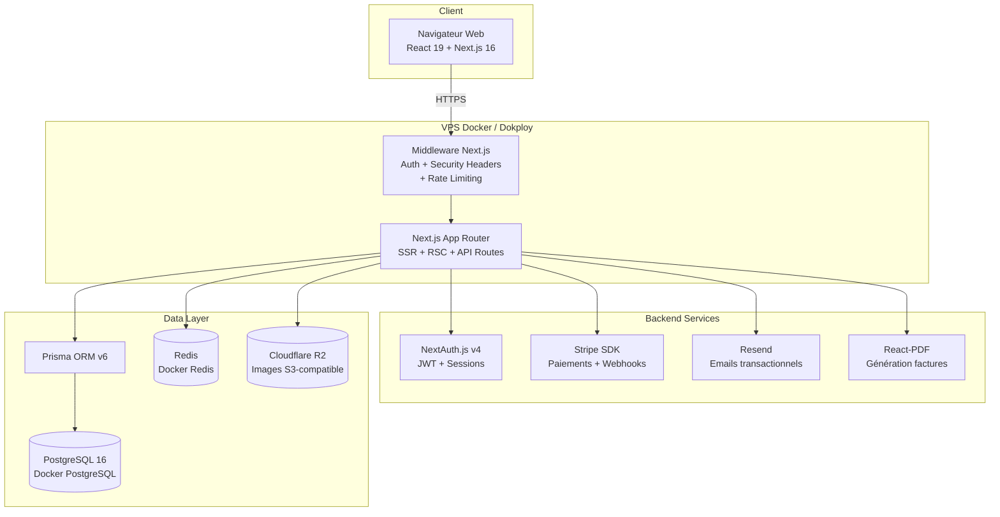
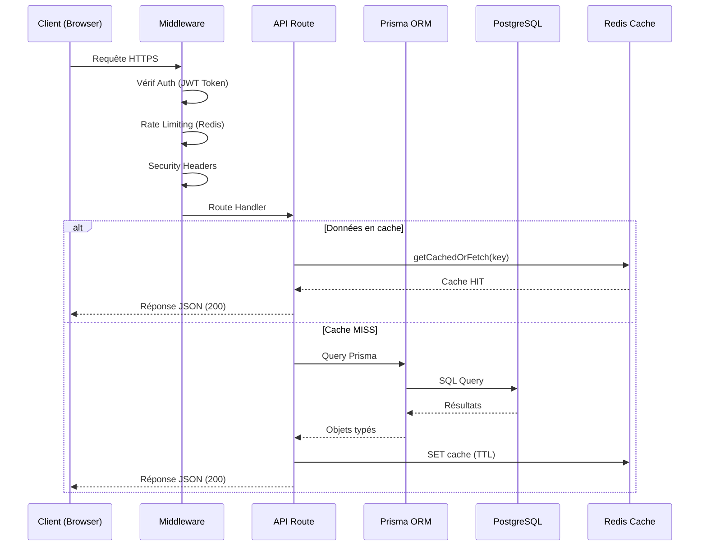
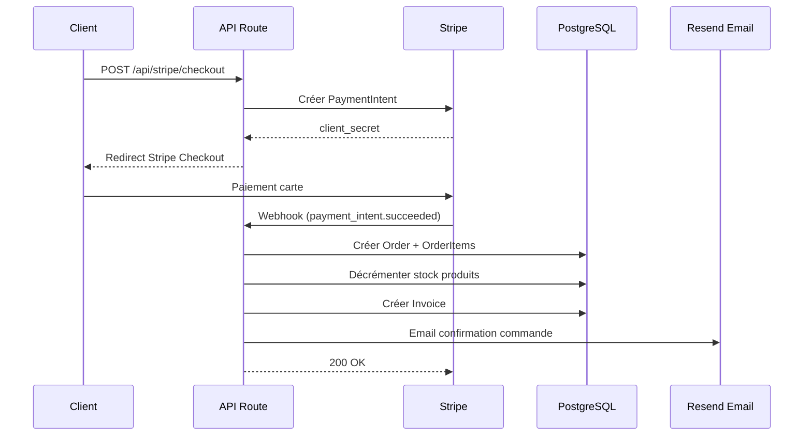

# Document de Conception Technique (DCT) — Althea Systems

**Version :** 1.0
**Date :** 26 mars 2026
**Auteur :** Samy (auth-infra)
**Projet :** Althea Systems — Plateforme e-commerce B2B/B2C matériel médical

---

## 1. Architecture Globale



---

## 2. Flux de Données



### Flux Commande (Checkout)



---

## 3. Diagramme ERD (Entité-Relation)

```mermaid
erDiagram
    User ||--o{ Address : "has many"
    User ||--o{ Order : "places"
    User ||--o{ Account : "has many"
    User ||--o{ Session : "has many"
    User ||--o{ BackupCode : "has many"

    Category ||--o{ Product : "contains"
    Category ||--o{ Category : "parent/children"

    Product ||--o{ OrderItem : "ordered in"

    Order ||--o{ OrderItem : "contains"
    Order ||--|{ Address : "shipped to"
    Order ||--o| Invoice : "generates"
    Order ||--o{ CreditNote : "may have"
    Order ||--o{ OrderStatusHistory : "tracks"

    Invoice ||--o{ CreditNote : "may have"

    User {
        string id PK
        string email UK
        string password
        string firstName
        string lastName
        string phone
        string stripeCustomerId UK
        enum role "USER | ADMIN"
        enum status "PENDING | ACTIVE | INACTIVE"
        boolean twoFactorEnabled
        datetime lastLoginAt
        datetime createdAt
    }

    Product {
        string id PK
        string name
        string slug UK
        string description
        decimal price
        decimal comparePrice
        enum tva "TVA_20 | TVA_10 | TVA_5_5 | TVA_0"
        string sku UK
        int stock
        string[] images
        boolean featured
        enum status "DRAFT | PUBLISHED"
        string categoryId FK
    }

    Order {
        string id PK
        string orderNumber UK
        string userId FK
        string addressId FK
        enum status "PENDING | CONFIRMED | PROCESSING | SHIPPED | DELIVERED | CANCELLED"
        enum paymentStatus "PENDING | PAID | FAILED | REFUNDED"
        string paymentIntentId
        decimal subtotal
        decimal shippingCost
        decimal tax
        decimal total
    }

    OrderItem {
        string id PK
        string orderId FK
        string productId FK
        string name
        decimal price
        int quantity
    }

    Invoice {
        string id PK
        string invoiceNumber UK
        string orderId FK UK
        decimal amount
        enum status "PENDING | PAID | CANCELLED"
        string pdfUrl
    }

    CreditNote {
        string id PK
        string creditNumber UK
        string orderId FK
        string invoiceId FK
        decimal amount
        enum reason "CANCELLATION | REFUND | ERROR"
    }

    Category {
        string id PK
        string name
        string slug UK
        string description
        string image
        string parentId FK
        int order
        boolean active
    }

    Address {
        string id PK
        string userId FK
        string firstName
        string lastName
        string street
        string city
        string postalCode
        string country
        boolean isDefault
    }

    CarouselSlide {
        string id PK
        string title
        string subtitle
        string image
        string link
        int order
        boolean active
    }

    ContactMessage {
        string id PK
        string name
        string email
        string subject
        string message
        boolean read
    }
```

---

## 4. Justification des Choix Technologiques

### Frontend

| Technologie | Justification |
|------------|---------------|
| **Next.js 16** | App Router, RSC, SSR/SSG, API Routes intégrées, Turbopack, optimisation images |
| **React 19** | Server Components, Suspense, transitions, performances améliorées |
| **TypeScript** | Typage statique, autocomplétion, détection erreurs à la compilation |
| **Tailwind CSS 4** | Utility-first, performances (purge CSS), cohérence design |
| **shadcn/ui** | Composants accessibles (Radix UI), personnalisables, pas de vendor lock-in |
| **Zustand** | State management léger, pas de boilerplate, compatible RSC |
| **React Hook Form + Zod** | Formulaires performants avec validation schéma typée |

### Backend

| Technologie | Justification |
|------------|---------------|
| **Next.js API Routes** | Colocalisation frontend/backend, serverless, typage partagé |
| **Prisma ORM v6** | Type-safe, migrations, introspection, excellent DX |
| **NextAuth.js v4** | Auth standard Next.js, OAuth, JWT, sessions, 2FA |
| **Stripe** | Standard industrie paiement, PCI-DSS compliant, webhooks fiables |
| **Resend** | API email moderne, templates React, bon deliverability |
| **Winston** | Logging structuré, rotation fichiers, niveaux par module |

### Infrastructure

| Technologie | Justification |
|------------|---------------|
| **PostgreSQL 16** | ACID, relations complexes, JSON, full-text search, standard industrie |
| **Redis (Docker Redis)** | Cache ultra-rapide, rate limiting, sessions |
| **Cloudflare R2** | S3-compatible, 0€ egress, CDN mondial intégré, stockage images |
| **Dokploy + Docker** | Déploiement sur VPS, Docker Compose, SSL Let's Encrypt, contrôle total |
| **GitHub Actions** | CI/CD natif GitHub, marketplace actions, gratuit pour repos publics |

### Pourquoi PAS

| Alternative rejetée | Raison |
|-------------------|--------|
| MongoDB pour images | R2 est S3-compatible, CDN intégré, 0€ egress, standard industrie |
| Express.js séparé | Next.js API Routes suffisent, évite la complexité d'un backend séparé |
| Redux | Trop de boilerplate pour ce projet, Zustand plus simple |
| Styled-components | Tailwind plus performant (CSS statique), meilleur DX |

---

## 5. Plan de Sécurité

### Authentification & Autorisation
- **NextAuth.js** : JWT tokens, sessions sécurisées, CSRF protection
- **2FA** : TOTP (Google Authenticator) + codes de backup
- **OAuth** : Google + GitHub (pas de stockage mot de passe tiers)
- **Bcrypt** : Hash des mots de passe (coût 12)
- **Validation mot de passe** : min 12 caractères, 1 majuscule, 1 minuscule, 1 chiffre, 1 spécial

### Protection API
- **Rate Limiting** : Redis-based, par IP, par route, par méthode HTTP
  - GET : 100 req/min
  - POST : 20 req/min
  - /api/contact : 5 req/h
  - /api/auth : 5 req/min (anti brute-force)
- **Validation entrées** : Zod sur TOUTES les routes API
- **Sanitization** : DOMPurify contre XSS
- **CORS** : Whitelist domaines autorisés

### Headers de Sécurité
```
X-Frame-Options: DENY
X-Content-Type-Options: nosniff
X-XSS-Protection: 1; mode=block
Referrer-Policy: strict-origin-when-cross-origin
Content-Security-Policy: default-src 'self'; ...
Strict-Transport-Security: max-age=31536000; includeSubDomains
Permissions-Policy: camera=(), microphone=(), geolocation=()
```

### Protection Données
- **HTTPS** obligatoire (redirect HTTP → HTTPS)
- **Secrets** dans variables d'environnement (jamais committés)
- **.env** dans .gitignore
- **Prisma** : protection native contre SQL injection (requêtes paramétrées)
- **npm audit** : audit régulier des dépendances

### Paiement
- **Stripe** : PCI-DSS Level 1 compliant
- **Webhook** : Signature vérifiée (STRIPE_WEBHOOK_SECRET)
- **Pas de stockage** de données carte côté serveur

---

## 6. Conformité RGPD

### Droits des utilisateurs
| Droit | Implémentation |
|-------|---------------|
| **Information** (Art. 13) | Page `/legal/privacy` avec politique de confidentialité |
| **Accès** (Art. 15) | API `GET /api/profile/export` (JSON) |
| **Rectification** (Art. 16) | Formulaire profil utilisateur |
| **Effacement** (Art. 17) | API `DELETE /api/profile/delete` (droit à l'oubli) |
| **Portabilité** (Art. 20) | Export JSON des données personnelles |
| **Opposition** (Art. 21) | Opt-out analytics, suppression compte |

### Consentement cookies
- Bannière de consentement au premier accès
- 3 niveaux : Essentiels (obligatoire), Analytiques, Marketing
- Consentement stocké en localStorage
- Respect du choix utilisateur (pas de tracking sans consentement)

### Mesures techniques
- Chiffrement mots de passe (bcrypt)
- Logs anonymisés (pas d'emails/IPs en clair en production)
- Suppression cascade des données utilisateur
- Anonymisation des commandes après suppression compte
- Contact DPO documenté dans la politique de confidentialité

---

## 7. Plan de Maintenance et Évolutivité

> Voir `docs/MAINTENANCE.md` pour le détail complet.

### Résumé
- **Mises à jour** : Audit npm hebdomadaire, MAJ mineures bimensuelles
- **Backups** : Quotidiens (BDD), rétention 30 jours
- **Monitoring** : UptimeRobot (uptime), Winston logs (erreurs)
- **Scaling** : Serverless Dokploy (auto), Redis Docker Redis (auto), PostgreSQL Docker PostgreSQL (branches)
- **SLA** : 99.9% uptime, <200ms API (P95), <2s LCP

### Évolutivité technique
- Architecture Docker → scaling horizontal via load balancer
- Cache Redis → réduction charge BDD
- CDN Cloudflare → distribution mondiale des assets
- Prisma → migrations versionnées, rollback possible
- Next.js ISR → pages statiques régénérées à la demande
