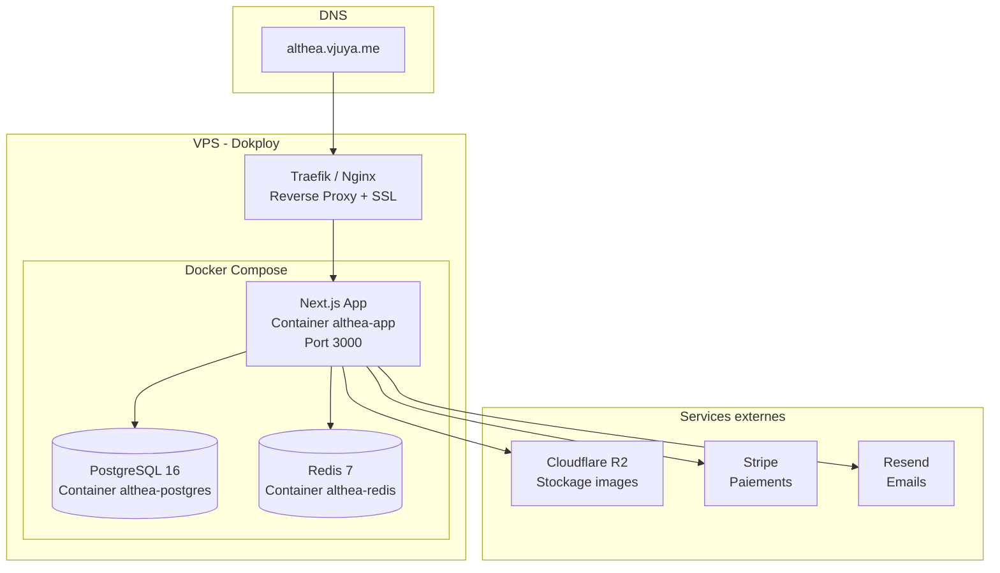

# Guide de Déploiement Production — Althea Systems

**Domaine :** `althea.vjuya.me`
**Hébergement :** VPS + Dokploy + Docker

---

## 1. Architecture de Déploiement



---

## 2. Prérequis VPS

| Requis | Minimum |
|--------|---------|
| OS | Ubuntu 22.04+ / Debian 12+ |
| RAM | 2 GB |
| CPU | 2 vCPU |
| Disque | 20 GB SSD |
| Docker | 24+ |
| Docker Compose | v2+ |
| Dokploy | Installé et configuré |

---

## 3. Installation Dokploy

```bash
# Installer Dokploy sur le VPS
curl -sSL https://dokploy.com/install.sh | sh

# Accéder au dashboard Dokploy
# https://<ip-vps>:3000 (premier lancement)
```

### Configuration dans Dokploy
1. Ajouter le repo GitHub `itsaam/althea-systems`
2. Source : `docker/docker-compose.yml`
3. Domaine : `althea.vjuya.me`
4. SSL : Let's Encrypt automatique
5. Variables d'environnement (voir section 4)

---

## 4. Variables d'Environnement Production

Configurer dans **Dokploy → Application → Environment** :

### Application
```
NODE_ENV=production
NEXT_PUBLIC_APP_URL=https://althea.vjuya.me
```

### Base de données
```
DATABASE_URL=postgresql://althea:<MOT_DE_PASSE_FORT>@postgres:5432/althea_db
```

### Authentification
```
NEXTAUTH_SECRET=<générer avec: openssl rand -base64 32>
NEXTAUTH_URL=https://althea.vjuya.me
```

### OAuth Providers
```
GOOGLE_CLIENT_ID=<Google Cloud Console>
GOOGLE_CLIENT_SECRET=<Google Cloud Console>
GITHUB_CLIENT_ID=<GitHub OAuth App>
GITHUB_CLIENT_SECRET=<GitHub OAuth App>
```
> **Important :** Mettre à jour les URLs de callback OAuth avec `https://althea.vjuya.me/api/auth/callback/google` et `https://althea.vjuya.me/api/auth/callback/github`

### Stripe (Paiements)
```
STRIPE_SECRET_KEY=sk_live_...
STRIPE_PUBLISHABLE_KEY=pk_live_...
STRIPE_WEBHOOK_SECRET=whsec_...
```
> Configurer le webhook Stripe : `https://althea.vjuya.me/api/stripe/webhook`

### Redis
```
REDIS_URL=redis://redis:6379
```

### Cloudflare R2 (Images)
```
R2_ACCOUNT_ID=<Cloudflare Dashboard>
R2_ACCESS_KEY_ID=<R2 API Token>
R2_SECRET_ACCESS_KEY=<R2 API Token>
R2_BUCKET_NAME=althea-images
R2_PUBLIC_URL=https://pub-xxx.r2.dev
```

### Emails
```
RESEND_API_KEY=re_...
RESEND_FROM_EMAIL=noreply@vjuya.me
```

### Logging
```
LOG_LEVEL=warn
LOG_DIR=logs
```

---

## 5. Docker Compose Production

Le fichier `docker/docker-compose.yml` contient 3 services :

| Service | Image | Port | Volume |
|---------|-------|------|--------|
| `althea-app` | Build depuis `docker/Dockerfile` | 3000 | — |
| `althea-postgres` | `postgres:16-alpine` | 5432 | `postgres_data` |
| `althea-redis` | `redis:7-alpine` | 6379 | `redis_data` |

### Déploiement manuel (sans Dokploy)
```bash
# Sur le VPS
git clone https://github.com/itsaam/althea-systems.git
cd althea-systems

# Copier et remplir les variables
cp .env.example .env
nano .env

# Lancer en production
docker compose -f docker/docker-compose.yml up -d --build

# Appliquer les migrations
docker exec althea-app npx prisma migrate deploy

# Seed (premier déploiement uniquement)
docker exec althea-app npx prisma db seed
```

---

## 6. SSL/TLS

### Via Dokploy (automatique)
- Let's Encrypt automatique
- Renouvellement automatique
- HTTPS forcé (redirect HTTP → HTTPS)

### Via Traefik (si config manuelle)
```yaml
# Dans docker-compose.yml, ajouter les labels Traefik :
labels:
  - "traefik.enable=true"
  - "traefik.http.routers.althea.rule=Host(`althea.vjuya.me`)"
  - "traefik.http.routers.althea.tls.certresolver=letsencrypt"
  - "traefik.http.services.althea.loadbalancer.server.port=3000"
```

---

## 7. DNS

Configurer chez le registrar du domaine `vjuya.me` :

| Type | Nom | Valeur | TTL |
|------|-----|--------|-----|
| `A` | `althea` | `<IP_DU_VPS>` | 300 |

---

## 8. Backups BDD

### Script backup automatique
```bash
#!/bin/bash
# /opt/scripts/backup-althea.sh
DATE=$(date +%Y%m%d_%H%M)
BACKUP_DIR=/opt/backups/althea

mkdir -p $BACKUP_DIR

# Dump PostgreSQL depuis le container
docker exec althea-postgres pg_dump -U althea althea_db -F c > $BACKUP_DIR/althea_$DATE.dump

# Garder seulement les 30 derniers backups
ls -t $BACKUP_DIR/*.dump | tail -n +31 | xargs rm -f 2>/dev/null

echo "Backup $DATE terminé"
```

### Cron (quotidien à 3h)
```bash
crontab -e
# Ajouter :
0 3 * * * /opt/scripts/backup-althea.sh >> /var/log/althea-backup.log 2>&1
```

### Restauration
```bash
docker exec -i althea-postgres pg_restore -U althea -d althea_db < /opt/backups/althea/althea_YYYYMMDD.dump
```

---

## 9. Monitoring Uptime

### UptimeRobot (gratuit)
| Monitor | URL | Intervalle |
|---------|-----|-----------|
| Site | `https://althea.vjuya.me` | 5 min |
| API | `https://althea.vjuya.me/api/products` | 5 min |

### Vérification containers
```bash
# Status des containers
docker compose -f docker/docker-compose.yml ps

# Logs en temps réel
docker compose -f docker/docker-compose.yml logs -f app

# Santé PostgreSQL
docker exec althea-postgres pg_isready -U althea

# Santé Redis
docker exec althea-redis redis-cli ping
```

---

## 10. Rollback

### Rollback application
```bash
# Via Dokploy : cliquer "Redeploy" sur le déploiement précédent

# Via Docker manuellement :
docker compose -f docker/docker-compose.yml down
git checkout <commit-stable>
docker compose -f docker/docker-compose.yml up -d --build
```

### Rollback BDD
```bash
# Revert migration
docker exec althea-app npx prisma migrate resolve --rolled-back <migration_name>

# Restaurer backup
docker exec -i althea-postgres pg_restore -U althea -d althea_db --clean < backup.dump
```

---

## 11. Mise à jour

```bash
# 1. Pull les changements
git pull origin main

# 2. Rebuild et redéployer
docker compose -f docker/docker-compose.yml up -d --build

# 3. Appliquer les nouvelles migrations
docker exec althea-app npx prisma migrate deploy

# 4. Vérifier
docker compose -f docker/docker-compose.yml ps
curl -s https://althea.vjuya.me/api/products | head -c 100
```

---

## 12. Checklist Pré-Déploiement

- [ ] Toutes les variables d'environnement configurées
- [ ] `npm run build` passe en local
- [ ] Docker build réussi : `docker compose -f docker/docker-compose.yml build`
- [ ] Migrations appliquées
- [ ] DNS configuré (`althea.vjuya.me` → IP VPS)
- [ ] SSL actif (Let's Encrypt via Dokploy)
- [ ] Stripe webhook configuré avec URL production
- [ ] OAuth callbacks mis à jour
- [ ] Monitoring configuré (UptimeRobot)
- [ ] Backup BDD automatique en place (cron)
