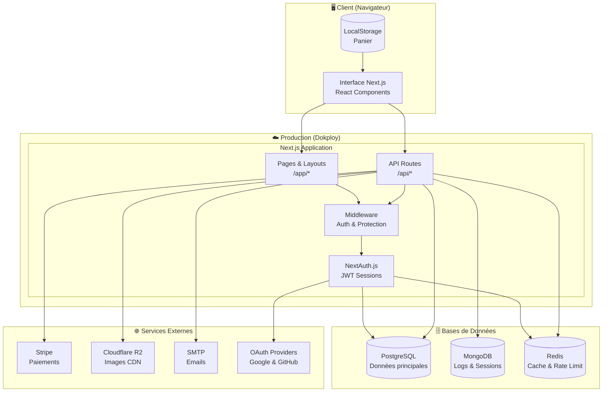
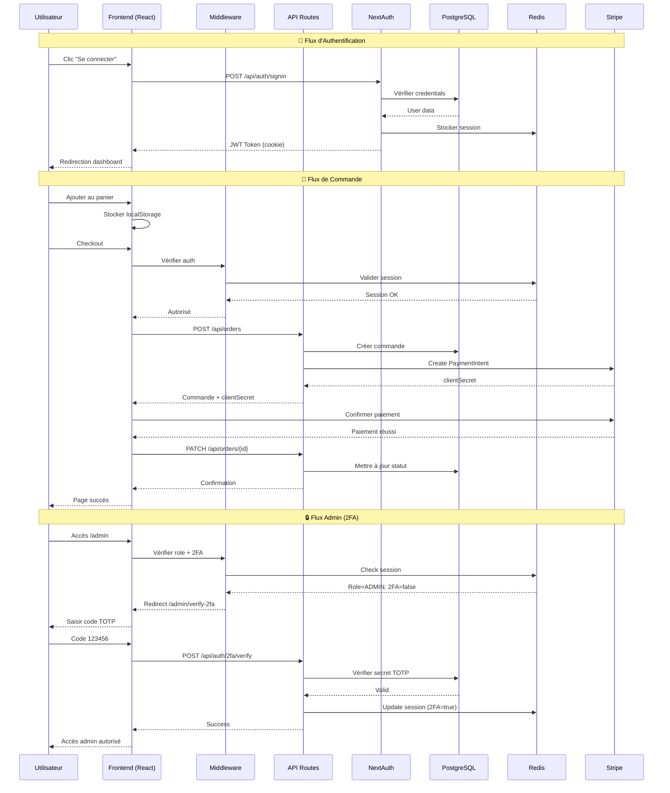
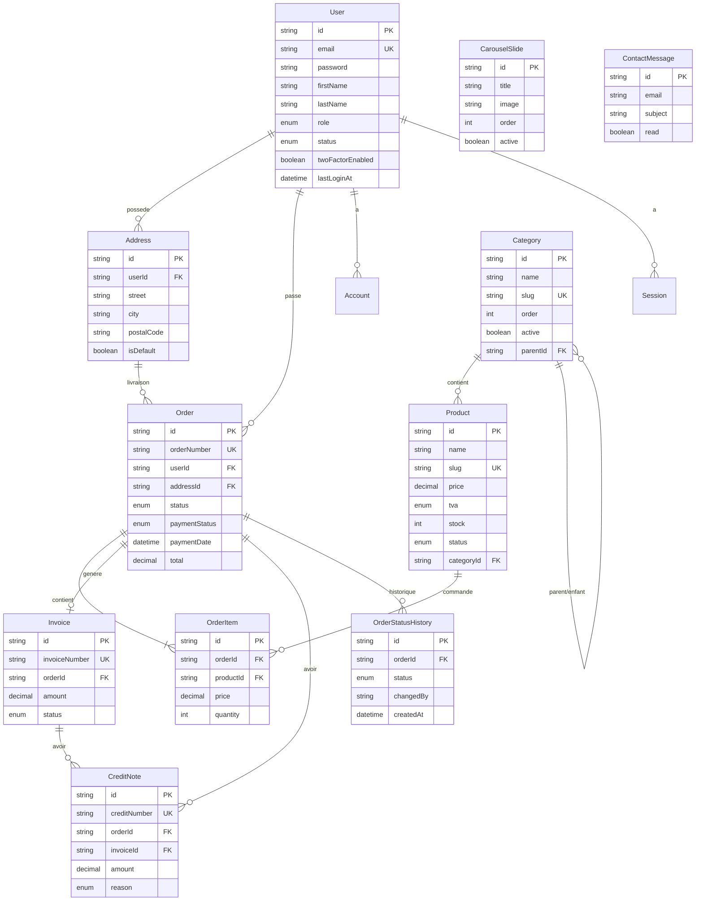

# Diagrammes Techniques - Althea Systems

**Projet** : Althea Systems - Plateforme e-commerce B2B  
**Date** : 19 decembre 2025

---

## 1. Diagramme d'Architecture Globale

Vue d'ensemble de l'infrastructure technique du projet.



---

## 2. Diagramme de Flux de Données

Comment les données circulent entre les différents systèmes.

```mermaid
flowchart LR
    subgraph Frontend["Frontend"]
        User((Utilisateur))
        Browser[Navigateur]
    end

    subgraph API["API Routes"]
        AuthAPI[/api/auth/*]
        ProductAPI[/api/products]
        OrderAPI[/api/orders]
        CartAPI[/api/cart]
        ProfileAPI[/api/profile]
        UploadAPI[/api/upload]
    end

    subgraph Cache["Cache Layer"]
        Redis[(Redis)]
    end

    subgraph Storage["Stockage"]
        PG[(PostgreSQL)]
        R2[(Cloudflare R2)]
    end

    subgraph External["Externe"]
        Stripe[Stripe API]
        Email[SMTP]
    end

    User --> Browser
    Browser -->|1. Requête| AuthAPI
    Browser -->|2. Navigation| ProductAPI
    Browser -->|3. Ajout panier| CartAPI
    Browser -->|4. Commande| OrderAPI
    Browser -->|5. Upload image| UploadAPI

    AuthAPI -->|Vérification| Redis
    AuthAPI -->|CRUD User| PG

    ProductAPI -->|Cache hit?| Redis
    ProductAPI -->|Données| PG
    Redis -.->|Cache miss| PG

    CartAPI -->|Session| Redis
    
    OrderAPI -->|Créer commande| PG
    OrderAPI -->|Paiement| Stripe
    OrderAPI -->|Confirmation| Email

    ProfileAPI -->|Update| PG

    UploadAPI -->|Stocker image| R2
    UploadAPI -->|Sauver URL| PG
```

---

## 3. Diagramme de Communication des Services (API)

Interactions entre le frontend et le backend via les API.



---

## 4. Schéma de la Base de Données (ERD)

Relations entre les entités PostgreSQL.



---

## 5. Architecture des Dossiers

Structure du code source.

```
src/
├── app/                    # Next.js App Router
│   ├── (auth)/            # Pages auth (login, register, etc.)
│   ├── (main)/            # Pages publiques (/, /products, etc.)
│   ├── admin/             # Back-office (protégé ADMIN + 2FA)
│   └── api/               # API Routes
│       ├── auth/          # NextAuth + 2FA
│       ├── products/      # CRUD produits
│       ├── orders/        # Gestion commandes
│       ├── users/         # Gestion utilisateurs
│       ├── stripe/        # Webhooks paiement
│       └── ...
├── components/            # Composants React réutilisables
│   ├── ui/               # Composants UI (shadcn)
│   └── ...
├── lib/                  # Utilitaires et configurations
│   ├── auth.ts          # Config NextAuth
│   ├── prisma.ts        # Client Prisma
│   ├── redis.ts         # Client Redis + helpers cache
│   ├── r2.ts            # Upload Cloudflare R2
│   └── config/
│       └── env.ts       # Validation variables env
└── middleware.ts        # Protection routes (auth, admin, 2FA)

prisma/
└── schema.prisma        # Schéma base de données

docker/
├── Dockerfile           # Build multi-stage
└── docker-compose.yml   # Services dev local
```

---

## Légende

| Symbole | Signification |
|---------|---------------|
| `PK` | Primary Key |
| `FK` | Foreign Key |
| `UK` | Unique Key |
| `||--o{` | One-to-Many |
| `||--|{` | One-to-Many (obligatoire) |
| `||--o|` | One-to-One (optionnel) |
