# Architecture technique — Althea Systems

Document annexe au document de cadrage. Représente visuellement l'architecture décrite en section 6 et les flux entre composants.

## Vue d'ensemble (graph TD)

```mermaid
graph TD
    %% ==================== CLIENTS ====================
    subgraph Clients["Clients (navigateur)"]
        Mobile["Mobile<br/>iOS / Android"]
        Desktop["Desktop<br/>Windows / macOS / Linux"]
    end

    %% ==================== ENTREE ====================
    CF["Cloudflare<br/>(DNS + protection)"]
    Traefik["Traefik<br/>(reverse proxy + TLS)"]

    %% ==================== APP ====================
    subgraph VPS["VPS européen (Dokploy)"]
        subgraph NextApp["Next.js App (conteneur Docker)"]
            Public["Frontend public<br/>(SSR + ISR)"]
            Admin["Back-office admin<br/>(SSR protégé)"]
            ApiRoutes["API Routes<br/>(/api/*)"]
            NextAuth["NextAuth.js<br/>(sessions + OAuth + TOTP)"]
        end

        Postgres[("PostgreSQL 16<br/>(données métier)")]
        Redis[("Redis 7<br/>(cache + rate limit)")]
    end

    %% ==================== EXTERNES ====================
    subgraph External["Services externes"]
        Stripe["Stripe<br/>(paiement + webhook)"]
        R2["Cloudflare R2<br/>(images produits)"]
        Resend["Resend<br/>(emails transactionnels)"]
        Google["Google OAuth"]
        GitHub["GitHub OAuth"]
        OpenAI["OpenAI API<br/>(chatbot)"]
    end

    %% ==================== CI/CD ====================
    subgraph CI["CI/CD"]
        GHActions["GitHub Actions<br/>(lint + test + build)"]
        GHRepo["GitHub Repo"]
    end

    %% ==================== FLUX CLIENT -> APP ====================
    Mobile -- "HTTPS" --> CF
    Desktop -- "HTTPS" --> CF
    CF -- "HTTPS" --> Traefik
    Traefik -- "HTTP interne" --> Public
    Traefik -- "HTTP interne" --> Admin
    Traefik -- "HTTP interne" --> ApiRoutes

    %% ==================== FLUX APP -> DATA ====================
    Public -- "SQL via Prisma" --> Postgres
    Admin -- "SQL via Prisma" --> Postgres
    ApiRoutes -- "SQL via Prisma" --> Postgres
    Public -- "GET / SET cache" --> Redis
    ApiRoutes -- "GET / SET cache<br/>+ rate limit" --> Redis
    NextAuth -- "Sessions" --> Postgres

    %% ==================== FLUX AUTH ====================
    NextAuth -- "OAuth2" --> Google
    NextAuth -- "OAuth2" --> GitHub

    %% ==================== FLUX PAIEMENT ====================
    ApiRoutes -- "Création session paiement<br/>(HTTPS)" --> Stripe
    Stripe -- "Webhook signé<br/>(POST /api/stripe/webhook)" --> ApiRoutes

    %% ==================== FLUX MEDIA ====================
    Admin -- "Upload signé" --> R2
    Public -- "GET image (CDN)" --> R2
    Mobile -- "GET image directe (CDN)" --> R2
    Desktop -- "GET image directe (CDN)" --> R2

    %% ==================== FLUX EMAIL ====================
    ApiRoutes -- "POST email" --> Resend
    Resend -- "SMTP" --> Mobile
    Resend -- "SMTP" --> Desktop

    %% ==================== FLUX CHATBOT ====================
    ApiRoutes -- "Prompt + contexte" --> OpenAI
    OpenAI -- "Réponse" --> ApiRoutes

    %% ==================== FLUX CI/CD ====================
    GHRepo -- "Push / PR" --> GHActions
    GHActions -- "Tests + build" --> GHActions
    GHActions -- "Webhook deploy" --> VPS

    %% ==================== STYLE ====================
    classDef client fill:#e0f2fe,stroke:#0369a1,color:#0c4a6e
    classDef app fill:#fef3c7,stroke:#b45309,color:#78350f
    classDef data fill:#dcfce7,stroke:#15803d,color:#14532d
    classDef external fill:#fce7f3,stroke:#be185d,color:#831843
    classDef ci fill:#ede9fe,stroke:#6d28d9,color:#4c1d95

    class Mobile,Desktop client
    class Public,Admin,ApiRoutes,NextAuth app
    class Postgres,Redis data
    class Stripe,R2,Resend,Google,GitHub,OpenAI external
    class GHActions,GHRepo ci
```

## Légende des flux

| Source | Destination | Type | Description |
|--------|-------------|------|-------------|
| Navigateur | Cloudflare | HTTPS | DNS + protection anti-DDoS |
| Cloudflare | Traefik | HTTPS | TLS terminé sur Traefik |
| Traefik | Next.js | HTTP interne | Reverse proxy dans le réseau Docker |
| Next.js | PostgreSQL | TCP (Prisma) | Lecture / écriture des données métier |
| Next.js | Redis | TCP | Cache pages, sessions chiffrées, rate limiting |
| Next.js | Stripe | HTTPS sortant | Création de Checkout Session |
| Stripe | Next.js | HTTPS entrant (webhook signé) | Notification `payment_intent.succeeded`, mise à jour commande |
| Next.js | Cloudflare R2 | HTTPS (S3-compatible) | Upload signé depuis le back-office |
| Navigateur | Cloudflare R2 | HTTPS (CDN public) | Lecture directe des images produits |
| Next.js | Resend | HTTPS (REST) | Envoi des emails transactionnels |
| Next.js | OpenAI | HTTPS (REST) | Prompts du chatbot, persistance des conversations en base |
| Next.js | Google / GitHub OAuth | OAuth2 | Connexion sociale via NextAuth |
| GitHub Actions | VPS | Webhook deploy | Déclenchement du déploiement Dokploy |

## Justifications architecturales (rappel)

- **Application unique Next.js** : un seul conteneur à déployer, déploiement simplifié pour une équipe de 4 étudiants. Les compartiments (frontend public, back-office, API) sont séparés logiquement par dossiers et middleware.
- **PostgreSQL + Prisma** : ORM typé, migrations versionnées, intégrité référentielle.
- **Redis** : cache court pour les pages catalogue, rate limiting pour `/api/auth/*` et `/api/contact`.
- **Stripe** : encaissement et stockage des données carte délégués → réduction drastique du périmètre PCI-DSS.
- **Cloudflare R2** : stockage S3-compatible sans frais d'egress (économie face à AWS S3).
- **Resend** : API simple, templates React Email, traçabilité des envois.
- **Dokploy + Traefik** : auto-hébergement low-cost (~30 €/mois), TLS automatique via Let's Encrypt.
- **GitHub Actions** : CI gratuite pour repos publics, intégration native.
