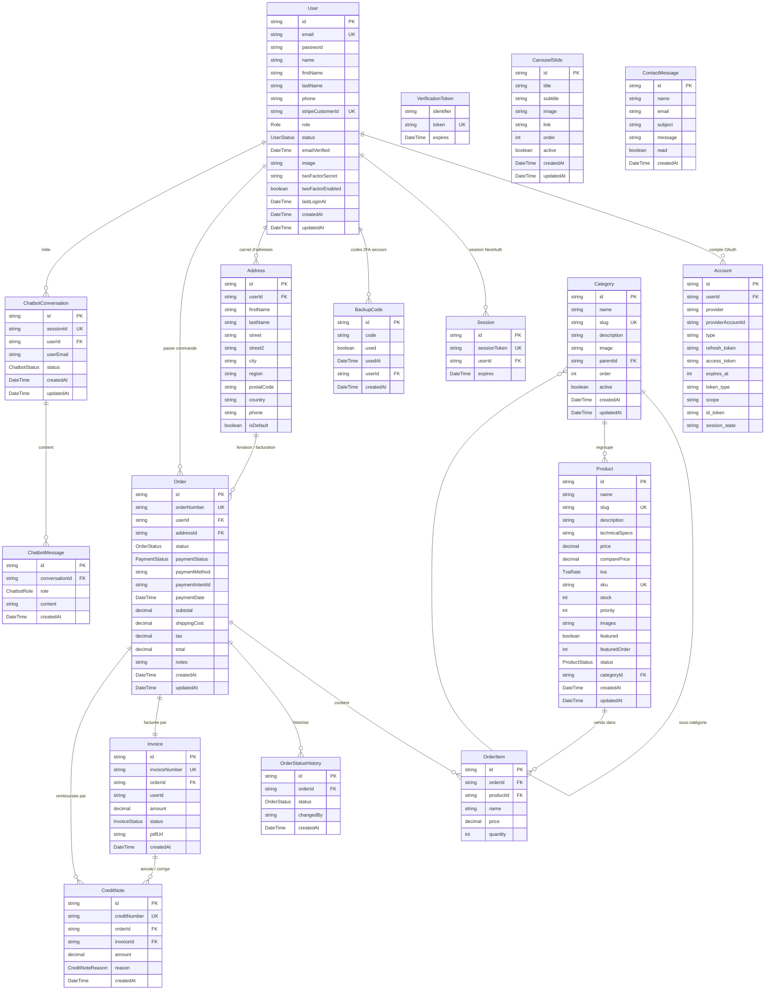

# Diagramme entité-relation — Althea Systems

Annexe au document de cadrage (section 8). Diagramme généré à partir de `prisma/schema.prisma`.

## Vue d'ensemble

17 modèles, regroupés en 5 domaines :

- **Identité et authentification** : `User`, `Account`, `Session`, `VerificationToken`, `BackupCode`
- **Catalogue** : `Category`, `Product`, `CarouselSlide`
- **Commande et facturation** : `Order`, `OrderItem`, `OrderStatusHistory`, `Invoice`, `CreditNote`
- **Carnet d'adresses** : `Address`
- **Relation client** : `ContactMessage`, `ChatbotConversation`, `ChatbotMessage`

## Diagramme Mermaid (erDiagram)

## Énumérations

| Enum | Valeurs |
|------|---------|
| `Role` | `USER`, `ADMIN` |
| `UserStatus` | `PENDING`, `ACTIVE`, `INACTIVE` |
| `ProductStatus` | `DRAFT`, `PUBLISHED` |
| `TvaRate` | `TVA_20`, `TVA_10`, `TVA_5_5`, `TVA_0` |
| `OrderStatus` | `PENDING`, `CONFIRMED`, `PROCESSING`, `SHIPPED`, `DELIVERED`, `CANCELLED` |
| `PaymentStatus` | `PENDING`, `PAID`, `FAILED`, `REFUNDED` |
| `InvoiceStatus` | `PENDING`, `PAID`, `CANCELLED` |
| `CreditNoteReason` | `CANCELLATION`, `REFUND`, `ERROR` |
| `ChatbotRole` | `USER`, `ASSISTANT`, `SYSTEM` |
| `ChatbotStatus` | `ACTIVE`, `ESCALATED`, `CLOSED` |

## Décisions de modélisation

- **Instantané des prix** : `OrderItem.price` et `OrderItem.name` sont dupliqués depuis `Product`, pour que les commandes restent cohérentes même si le produit est modifié ou supprimé ensuite.
- **Suppression douce des conversations chatbot** : `onDelete: SetNull` sur `ChatbotConversation.userId` — la suppression d'un utilisateur conserve l'historique des échanges (traçabilité support, conformément au CDC §XV).
- **Cascade stricte sur les sous-éléments** : `Account`, `Session`, `BackupCode`, `OrderItem`, `OrderStatusHistory`, `ChatbotMessage` sont supprimés en cascade avec leur entité parente.
- **Catégorie auto-référente** : `Category.parentId` permet une arborescence de catégories (CDC §VI).
- **TVA par produit** : `Product.tva` est un enum (4 taux français), recalculée au moment de la commande.
- **Index métier** : index composites sur `(featured, featuredOrder)`, `(userId, used)` pour les codes de secours, `(conversationId)` et `(createdAt)` sur les messages chatbot pour les requêtes du back-office.
