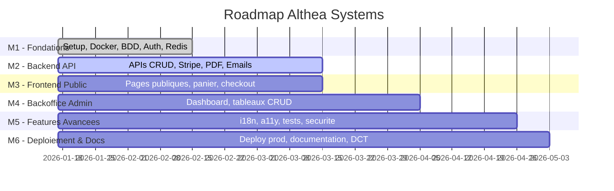
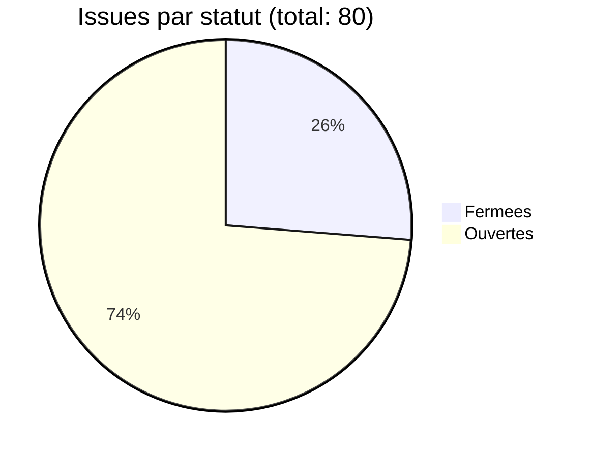
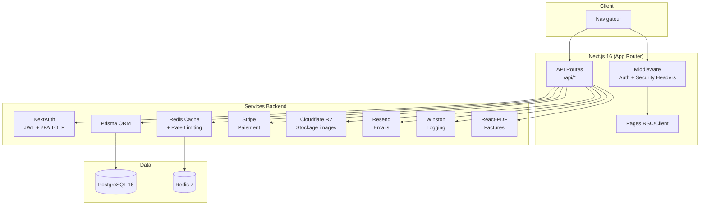
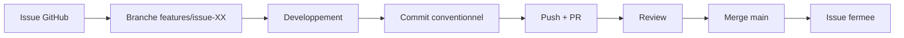

# Rapport de progression - Althea Systems

> Date du rapport : 26 mars 2026
> Auteur : Samy (auth-infra)
> Projet : Althea Systems - Plateforme e-commerce B2C

---

## 1. Vue d'ensemble du projet

**Stack technique :**
- Frontend : Next.js 16 (React 19.2, React Compiler, App Router)
- Backend : API Routes Next.js, Prisma ORM 6.19
- Base de donnees : PostgreSQL 16
- Cache : Redis 7 (ioredis)
- Authentification : NextAuth 4 (Credentials, Google, GitHub)
- Paiement : Stripe
- Stockage : Cloudflare R2 (S3-compatible)
- Emails : Resend
- Logging : Winston
- Validation : Zod
- Tests : Vitest, Testing Library, Playwright (prevu)
- UI : shadcn/ui, Radix UI, Tailwind CSS 4
- i18n : next-intl (FR, EN, AR)
- State : Zustand

---

## 2. Etat des milestones

### M1 - Fondations (8/8 issues fermees)
**Statut : TERMINE**
- [x] Setup initial Next.js 16 (#27)
- [x] Configuration Docker & Docker Compose (#28)
- [x] Schema Prisma complet (#29)
- [x] Seeder BDD avec donnees de test (#30)
- [x] Configuration NextAuth (Credentials, Google, GitHub) (#31)
- [x] Systeme 2FA (TOTP) pour admins (#32)
- [x] Middleware protection routes privees (#33)
- [x] Configuration Redis + helpers cache (#34)

### M2 - Backend API (9/14 issues fermees)
**Statut : EN COURS - 64% complete**
- [x] API Products CRUD complet (#47)
- [x] API Categories CRUD complet (#48)
- [x] API Orders + validation stock (#49)
- [x] API Users + gestion adresses (#50)
- [x] Integration Stripe paiement securise (#51)
- [x] Generation factures PDF automatique (#52)
- [x] API Contact + stockage messages (#55)
- [x] Calculs TVA automatiques HT/TTC (#92)
- [x] Gestion stock + alertes rupture (#95)
- [ ] Gestion images produits (upload + optimisation) (#80)
- [ ] Optimisation recherche (MeiliSearch/Algolia) (#82)
- [ ] Notifications email transactionnels (#93)
- [ ] Tests unitaires backend (#99)
- [ ] Tests integration API (#100)

### M3 - Frontend Public (0/21 issues fermees)
**Statut : A DEMARRER**

Issues ouvertes notables :
- i18n Multi-langues (#67)
- Accessibilite WCAG 2.1 AA (#68)
- Responsive design mobile-first (#83)
- Composants shadcn/ui personnalises (#88)

### M4 - Backoffice Admin (4/12 issues fermees)
**Statut : EN COURS - 33% complete**
- [x] Dashboard admin avec KPIs et graphiques (#57)
- [x] Gestion produits - Tableau CRUD avec filtres (#58)
- [x] Formulaires admin produit (creer/modifier) (#59)
- [ ] Gestion categories - Tableau + drag & drop (#60)
- [ ] Gestion commandes - Tableau avec statuts (#61)
- [ ] Gestion utilisateurs - Tableau avec actions admin (#62)
- [ ] Gestion factures et avoirs (#63)
- [ ] Gestion carrousel homepage (#64)
- [ ] Export CSV/Excel pour tous les tableaux (#66)

### M5 - Features Avancees (0/18 issues ouvertes)
**Statut : A DEMARRER**

### M6 - Deploiement & Docs (0/8 issues ouvertes)
**Statut : A DEMARRER**

---

## 3. Progression globale

| Milestone | Fermees | Ouvertes | Total | Progression |
|-----------|---------|----------|-------|-------------|
| M1 - Fondations | 8 | 0 | 8 | 100% |
| M2 - Backend API | 9 | 5 | 14 | 64% |
| M3 - Frontend Public | 0 | 21 | 21 | 0% |
| M4 - Backoffice Admin | 4 | 8 | 12 | 33% |
| M5 - Features Avancees | 0 | 18 | 18 | 0% |
| M6 - Deploiement & Docs | 0 | 8 | 8 | 0% |
| **Total** | **21** | **60** | **81** | **26%** |

---

## 4. Architecture technique implementee

### Modeles de donnees (Prisma)

| Modele | Description |
|--------|-------------|
| User | Utilisateurs avec roles (USER/ADMIN), 2FA, statuts |
| Account | Comptes OAuth (NextAuth PrismaAdapter) |
| Session | Sessions utilisateur |
| VerificationToken | Tokens de verification email |
| BackupCode | Codes de secours 2FA |
| Address | Adresses de livraison |
| Category | Categories produits (arborescentes) |
| Product | Produits avec TVA, stock, images, statuts |
| Order | Commandes avec statuts, paiement, historique |
| OrderItem | Lignes de commande |
| OrderStatusHistory | Historique des changements de statut |
| Invoice | Factures liees aux commandes |
| CarouselSlide | Slides du carrousel homepage |
| ContactMessage | Messages du formulaire de contact |
| CreditNote | Avoirs et remboursements |

### API Routes implementees

| Route | Description | Statut |
|-------|-------------|--------|
| `/api/auth/*` | NextAuth (login, register, OAuth) | Operationnel |
| `/api/products/*` | CRUD produits | Operationnel |
| `/api/categories/*` | CRUD categories | Operationnel |
| `/api/orders/*` | CRUD commandes | Operationnel |
| `/api/users/*` | Gestion utilisateurs | Operationnel |
| `/api/addresses/*` | Gestion adresses | Operationnel |
| `/api/invoices/*` | Gestion factures | Operationnel |
| `/api/credits/*` | Avoirs et remboursements | Operationnel |
| `/api/stripe/*` | Webhooks Stripe | Operationnel |
| `/api/upload/*` | Upload images R2 | Operationnel |
| `/api/contact/*` | Messages contact | Operationnel |
| `/api/carousel/*` | Gestion carrousel | Operationnel |
| `/api/cart/*` | Panier | Operationnel |
| `/api/stats/*` | Statistiques admin | Operationnel |
| `/api/profile/*` | Profil utilisateur | Operationnel |

---

## 5. Securite implementee

- Authentification NextAuth avec JWT
- 2FA TOTP obligatoire pour les admins
- Codes de secours 2FA (backup codes)
- Middleware de protection des routes (admin, compte)
- Rate limiting Redis par type de route (auth: 5/min, api: 100/min, admin: 50/min)
- Validation Zod sur les endpoints
- Headers de securite (X-Frame-Options, X-Content-Type-Options, Referrer-Policy)
- bcryptjs pour le hachage des mots de passe
- Secrets dans variables d'environnement

---

## 6. Workflow Git

**Convention de nommage des branches :**
- `features/issue-XX` - Nouvelles fonctionnalites
- `fix/*` - Corrections de bugs
- `chore/*` - Maintenance, nettoyage
- `docs/*` - Documentation
- `feat/*` - Features transversales

**Labels utilises :**
- `auth-infra` - Auth & Infrastructure (Samy)
- `backend-api` - APIs Backend
- `frontend-public` - Frontend public
- `frontend-admin` - Backoffice admin

---

## 7. Risques et points d'attention

| Risque | Impact | Mitigation |
|--------|--------|------------|
| M3 Frontend Public non demarre | Retard potentiel sur le planning | Prioriser les pages critiques (accueil, produits, panier) |
| M5 Features Avancees (0%) | Fonctionnalites non-essentielles reportees | Focus sur le MVP, reporter i18n/a11y si necessaire |
| Tests non implementes | Qualite du code non validee | Mettre en place Vitest + tests critiques avant deploy |
| Pas de CI/CD | Deploiement manuel | Configurer GitHub Actions (#85) |
| Pas de monitoring | Incidents non detectes | Configurer UptimeRobot + Vercel Analytics |

---

## 8. Prochaines etapes prioritaires

1. **Finaliser M2** : Images produits (#80), emails transactionnels (#93)
2. **Demarrer M3** : Pages publiques critiques (accueil, catalogue, panier)
3. **CI/CD** : GitHub Actions pour build + lint + tests (#85)
4. **Deploiement staging** : Vercel preview environments
5. **Tests** : Vitest pour les API routes critiques
6. **Documentation** : DCT complet (#98), documentation API (#101)
